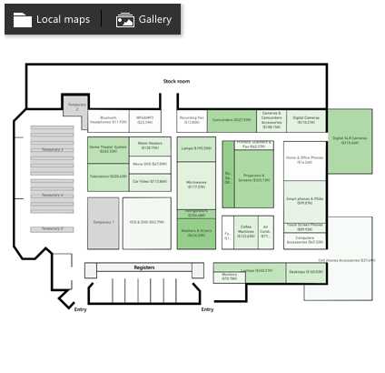

# Synoptic Panel for Power BI

Synoptic Panel by OKViz allows you to present one or more images (called maps, not necessarily geographical maps), assigning a meaning to arbitrary parts of them (called areas). You can highlight and color these areas dynamically and display several information over them. To design maps you can use a vector graphic editor or Synoptic Designer, a companion web tool located at https://synoptic.design/

Find out more on https://okviz.com/synoptic-panel/

## Changelog

A full changelog is available here: [CHANGELOG](/CHANGELOG.md)

## Submit an issue

To submit an issue, please visit [CONTRIBUTING](/CONTRIBUTING.md)

## Copyrights

Copyright (c) 2016-2017 OKViz - trademark of SQLBI Corp.

See the [LICENSE](/LICENSE) file for license rights and limitations (MIT).